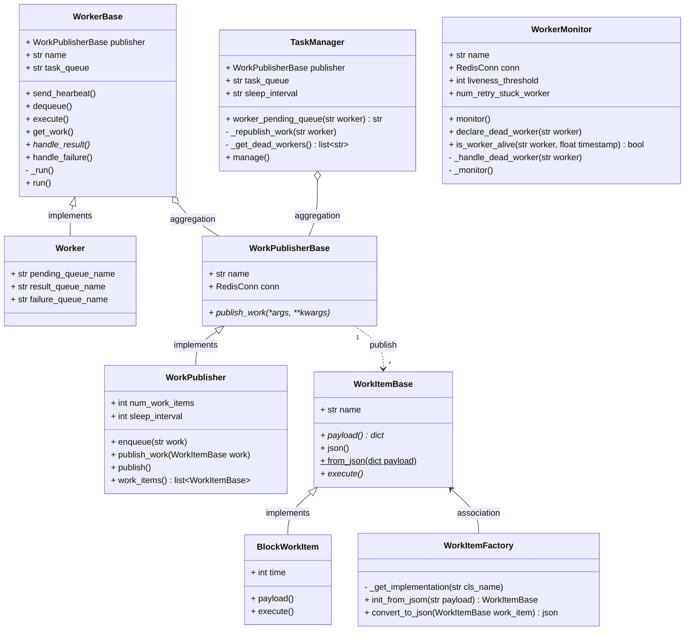
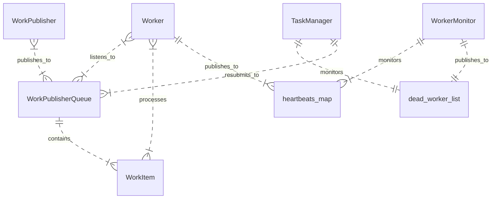

# Architecture Diagram

```mermaid
classDiagram
class WorkerBase{
    + WorkPublisherBase publisher
    + str name
    + str task_queue
    + send_hearbeat()
    + dequeue()
    + execute()
    + get_work()
    + handle_result()*
    + handle_failure()
    - _run()
    + run()
}

class Worker{
    + str pending_queue_name
    + str result_queue_name
    + str failure_queue_name
}

WorkerBase <|-- Worker : implements
WorkerBase o-- WorkPublisherBase : aggregation

class WorkPublisherBase{
    + str name
    + RedisConn conn
    + publish_work(*args, **kwargs)*
}

class WorkPublisher{
    + int num_work_items
    + int sleep_interval
    + enqueue( str work )
    + publish_work( WorkItemBase work )
    + publish()
    + work_items() list~WorkItemBase~
}
WorkPublisherBase <|-- WorkPublisher : implements

class WorkItemBase{
    + str name
    + payload() dict*
    + json()
    + from_json( dict payload )$
    + execute()*
}

class BlockWorkItem{
    + int time
    + payload()
    + execute()
}
WorkItemBase <|-- BlockWorkItem : implements

class WorkItemFactory{
    - _get_implementation( str cls_name )
    + init_from_jsom( str payload ) WorkItemBase
    + convert_to_json( WorkItemBase work_item ) json
}
WorkItemBase <-- WorkItemFactory : association
WorkPublisherBase "1"..>"*" WorkItemBase : publish

class TaskManager{
    + WorkPublisherBase publisher
    + str task_queue
    + str sleep_interval
    + worker_pending_queue( str worker ) str
    - _republish_work( str worker )
    - _get_dead_workers() list~str~
    + manage()
}
TaskManager o-- WorkPublisherBase : aggregation

class WorkerMonitor{
    + str name
    + RedisConn conn
    + int liveness_threshold
    + num_retry_stuck_worker
    + monitor()
    + declare_dead_worker( str worker )
    + is_worker_alive( str worker, float timestamp ) bool
    - _handle_dead_worker( str worker )
    - _monitor()
}

```
# Entity Relation Diagram

```mermaid

erDiagram
    WorkPublisher }|..|{ WorkPublisherQueue : publishes_to
    WorkPublisherQueue 1..|{ WorkItem : contains
    Worker }|..|{ WorkPublisherQueue : listens_to
    Worker }|..|{ WorkItem : processes
    Worker 1..|{ heartbeats_map : publishes_to
    WorkerMonitor 1..|{ heartbeats_map : monitors
    WorkerMonitor 1..1 dead_worker_list : publishes_to
    TaskManager 1..1 dead_worker_list: monitors
    TaskManager 1..|{ WorkPublisherQueue : resubmits_to


```